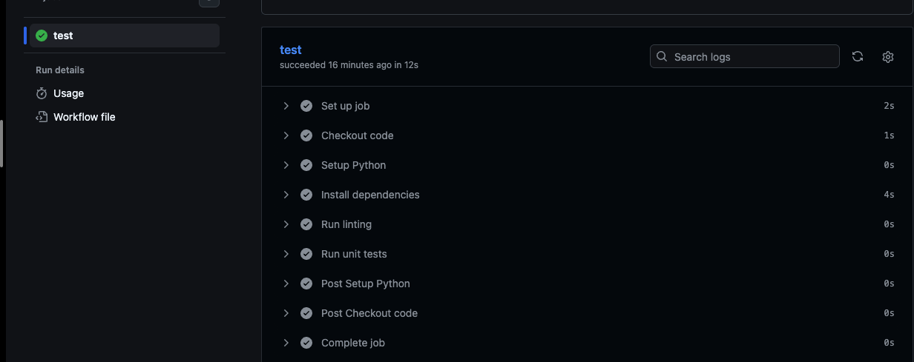
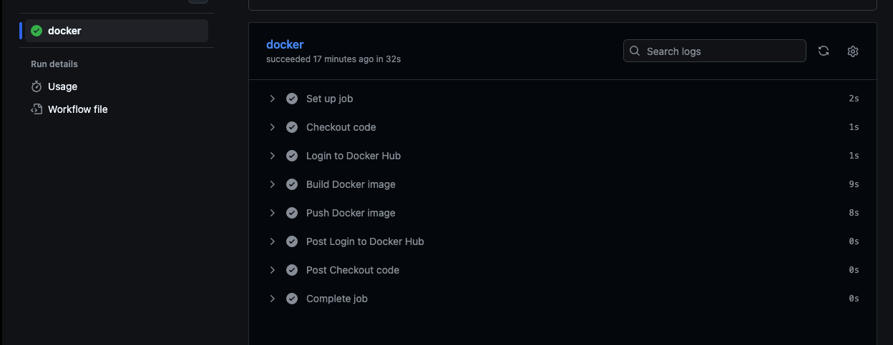

# CI/CD Pipeline with GitHub Actions

## Overview

Built a CI/CD pipeline using GitHub Actions to automate Python application testing and Docker image publishing.

The project includes:

* Continuous Integration (CI) for code validation
* Continuous Deployment (CD) for Docker image creation and publishing

---

## Project Structure

```text
08-CICD/
├── README.md
├── task-1/
├── task-2/
└── screenshots/
```

GitHub Actions workflows:

```text
.github/workflows/
├── ci.yaml
└── cd.yaml
```

---

# Task 1: Continuous Integration (CI)

## What I Built

Created a CI pipeline that runs automatically on pushes and pull requests.

The workflow:

* Sets up Python
* Installs dependencies
* Runs Flake8 for code quality checks
* Runs unit tests

Workflow file:

```text
.github/workflows/ci.yaml
```

Flow:

```text
Code Push
   ↓
Install Dependencies
   ↓
Run Linting
   ↓
Run Tests
   ↓
CI Passed
```

---

# Task 2: Continuous Deployment (CD)

## What I Built

Created a CD pipeline that automatically builds and pushes a Docker image to Docker Hub.

The workflow:

* Checks out the repository
* Authenticates with Docker Hub using GitHub Secrets
* Builds a Docker image
* Pushes the image to Docker Hub

Workflow file:

```text
.github/workflows/cd.yaml
```

Flow:

```text
Code Push
   ↓
Docker Login
   ↓
Build Image
   ↓
Push Image
   ↓
Docker Hub
```

---

# Screenshots

## CI Pipeline



## CD Pipeline



---

# What I Learned

* How to create GitHub Actions workflows using YAML.
* The difference between CI and CD.
* How to automate testing with GitHub Actions.
* How Docker images are built and pushed automatically.
* How to securely use GitHub Secrets.

---

# Issues Solved

* Fixed GitHub Actions workflow directory issues.
* Resolved YAML syntax and indentation errors.
* Fixed Docker build path issues.
* Configured Docker Hub authentication using access tokens.

---

# Technologies Used

* GitHub Actions
* Docker
* Docker Hub
* Python
* Flake8
* unittest
* YAML
